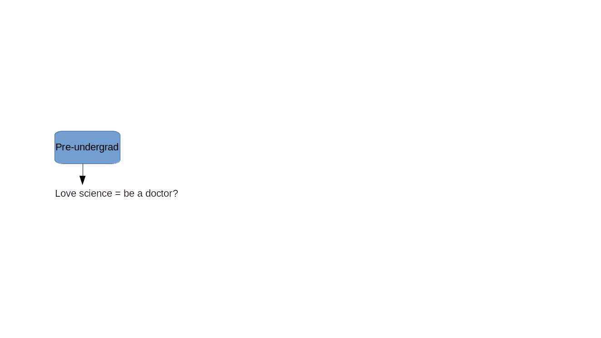
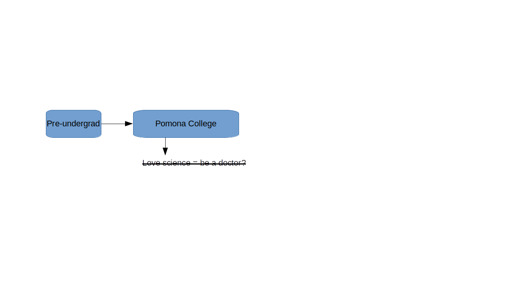
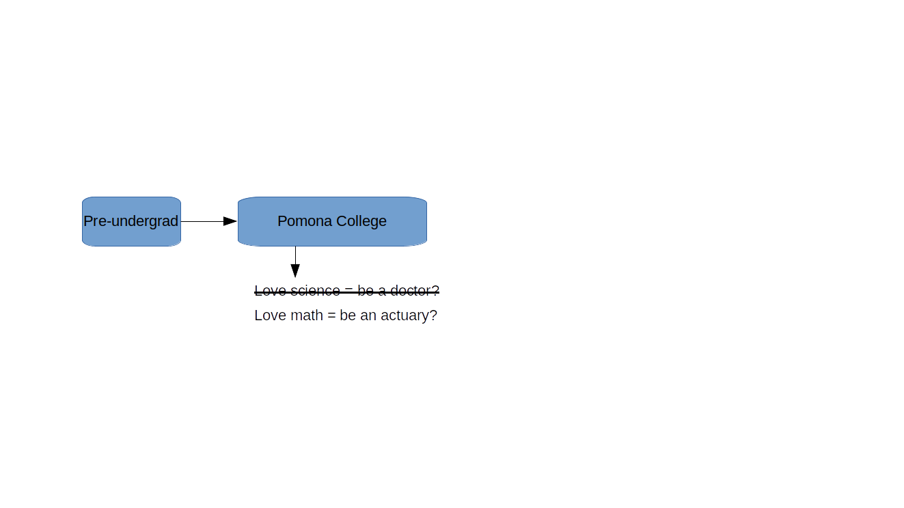
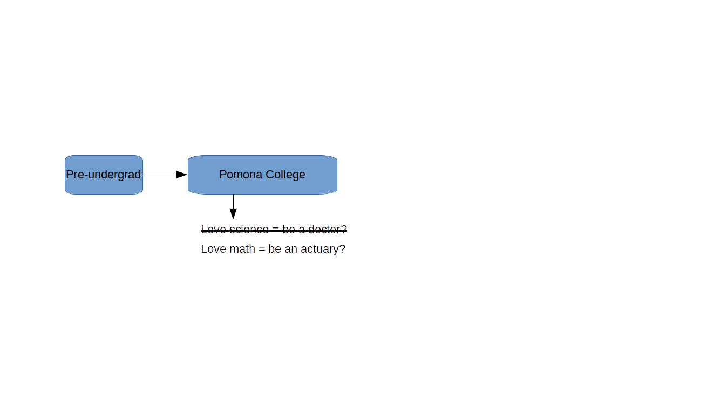
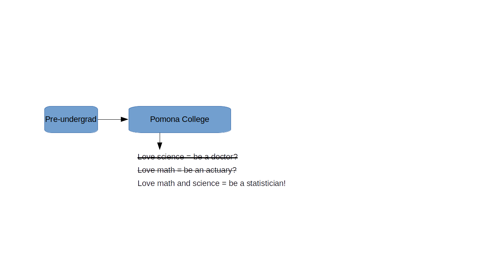
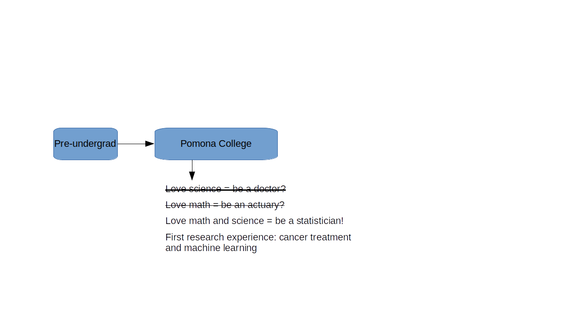
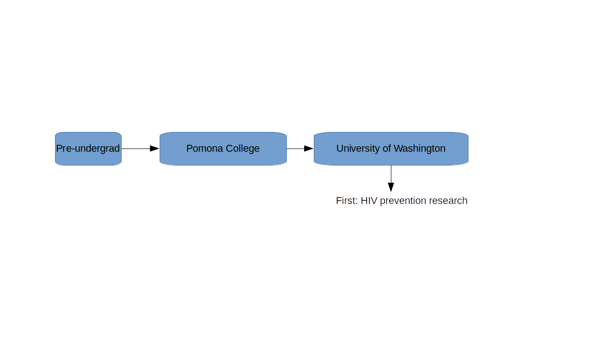
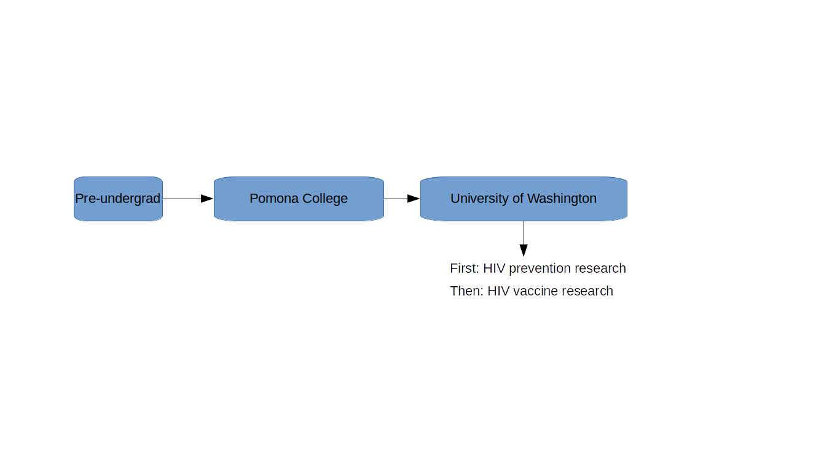
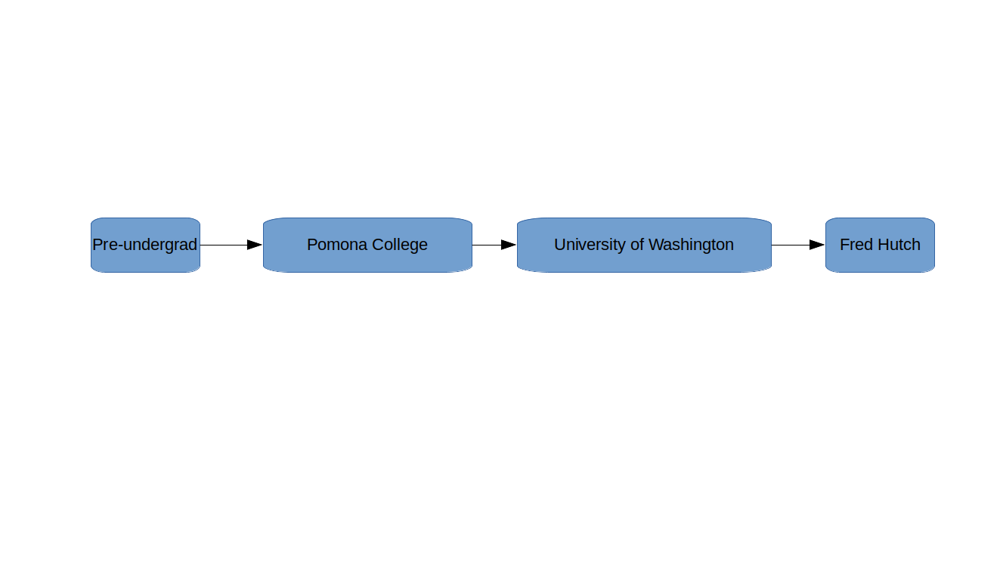
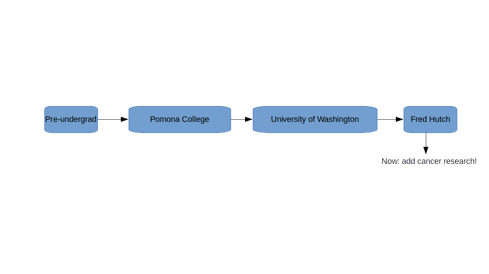

```{r xaringan-setup, include=FALSE, warning=FALSE}
library("xaringanthemer")

extra_css <- list(
  ".small" =  list(`font-size` = "80%"),
  ".large" =  list(`font-size` = "150%"),
  ".huge" =  list(`font-size` = "300%"),
  "ul li" = list(`margin-bottom` = "10px"),
  ".gray" = list(color = "#C0C0C0"),
  ".red" = list(color = "#FF0000"),
  ".blue1" = list(color = "#3AABBE"),
  ".blue2" = list(color = "#2A6D90"),
  ".blue3" = list(color = "#446874"),
  ".purple" = list(color = "#624474"),
  ".mutedred" = list(color = "#745344"),
  "a" = list(color = "#3AABBE"),
  "a:hover" = list("text-decoration" = "underline")
)
# set up fonts
style_mono_accent(
  base_color = "#446874",
  header_font_google = google_font("DM Sans"),
  text_font_google   = google_font("DM Sans", "400", "400i"),
  code_font_google   = google_font("Courier Prime"),
  extra_css = extra_css
)

xaringanExtra::use_tile_view()
```

<style type="text/css">
.remark-slide-content {
    font-size: 22px
}
</style>

## My journey to full-time statistics research

```{r timeline-1, echo = FALSE, out.width = "720px", fig.align = "center"}

```

---

## My journey to full-time statistics research

```{r timeline-2, echo = FALSE, out.width = "720px", fig.align = "center"}

```

---

## My journey to full-time statistics research

```{r timeline-3, echo = FALSE, out.width = "720px", fig.align = "center"}

```

---

## My journey to full-time statistics research

```{r timeline-4, echo = FALSE, out.width = "720px", fig.align = "center"}

```

---

## My journey to full-time statistics research

```{r timeline-5, echo = FALSE, out.width = "720px", fig.align = "center"}

```

---

## My journey to full-time statistics research

```{r timeline-6, echo = FALSE, out.width = "720px", fig.align = "center"}

```

---

## My journey to full-time statistics research

```{r timeline-7, echo = FALSE, out.width = "720px", fig.align = "center"}

```

---

## My journey to full-time statistics research

```{r timeline-8, echo = FALSE, out.width = "720px", fig.align = "center"}

```

---

## My journey to full-time statistics research

```{r timeline-9, echo = FALSE, out.width = "720px", fig.align = "center"}

```

---

## My journey to full-time statistics research

```{r timeline-10, echo = FALSE, out.width = "720px", fig.align = "center"}

```

---

## My journey to full-time statistics research

```{r timeline-11, echo = FALSE, out.width = "720px", fig.align = "center"}

```

---

## My journey to full-time statistics research

```{r timeline-12, echo = FALSE, out.width = "720px", fig.align = "center"}

```

---


## What do I do all day?

Biostatistics: turning data into knowledge (Patrick Heagerty, UW)

Most weeks for me involve:
--

* Coding or debugging in R and Python
--

* Reading scientific papers
--

* Doing math
--

* Meetings with collaborators:
--

    * doctors, infectious disease specialists
--

    * other statisticians
--

* Diversity, Equity, and Inclusion work
--

---

## What do I do all day?

Key skills:
* Curiosity
--

* Communication
--

* Time management
--

* Mathematical reasoning/logic

---

## Example: preparing for AMP

---

## Hypothesis testing

---

## Hypothesis testing

---

## Hypothesis testing

---

## Testing multiple hypotheses

---

## Adjusting for multiple comparisons

---

## Preparing for AMP

---

## Example: COVID-19 risk prediction

---

## Predicting clinical outcomes

---

## Machine learning? (aka "artificial intelligence")

---

## Machine learning: bias vs variance

---

## Machine learning: bias vs variance

---

## Machine learning: bias vs variance

---

## Bias-variance tradeoff in action

---

## Bias-variance tradeoff in action

---

## Machine learning: bias-variance tradeoff

---

## Example: HIV-1 vaccine regimen down-selection